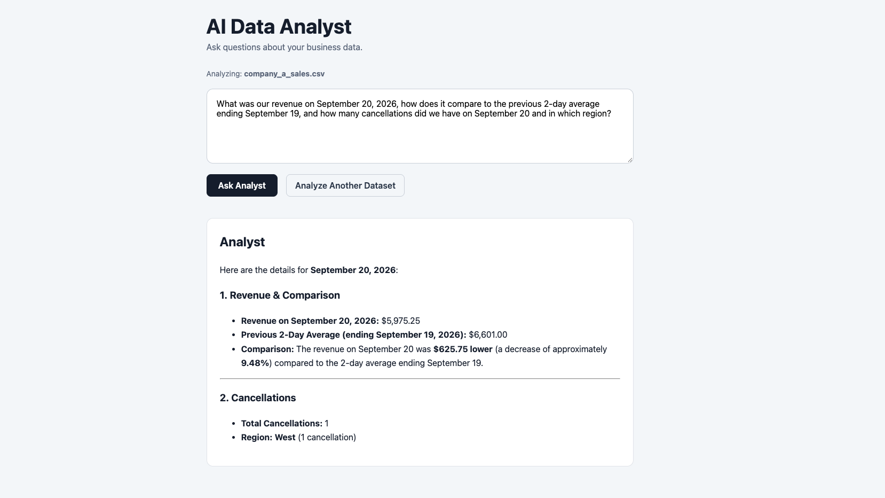
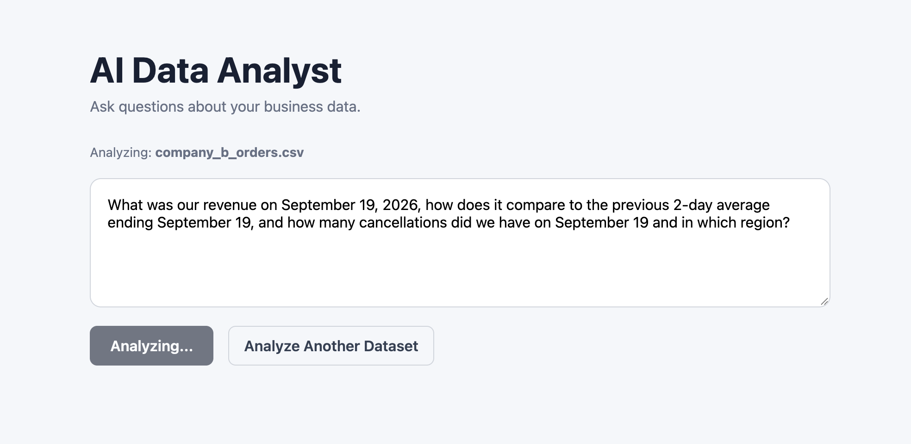
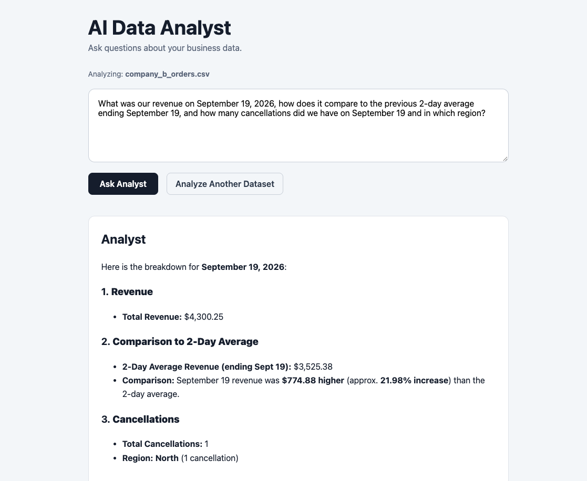

# AI Data Analyst

An AI-powered data analysis prototype that allows users to upload business data, map their dataset schema, and ask business questions in natural language.

The application uses an LLM to interpret the user's question and select the appropriate analytical tool, while deterministic Python code performs the actual calculations against the uploaded dataset.

## Why I Built This

Business data is often stored using different schemas.

One company might store sales data as:

```text
transaction_date
amount
region
status
```

while another might use:

```text
created_at
total_price
location
order_state
```

Hardcoding analytics logic for every company's schema does not scale.

This project introduces a schema-mapping layer that translates different customer datasets into a common business model, allowing the same AI agent, tools, and repository logic to analyze differently structured datasets.

## Core Workflow

```text
User uploads CSV
        ↓
Backend inspects dataset columns
        ↓
User maps columns to business concepts
        ↓
Mapping is validated
        ↓
Dataset configuration is stored in SQLite
        ↓
User asks a natural-language question
        ↓
LLM interprets intent and selects a tool
        ↓
Pydantic validates tool arguments
        ↓
Python repository performs calculation
        ↓
Tool result is returned to the LLM
        ↓
LLM produces a business-friendly answer
```

## Example

A user can upload a dataset and ask:

> How did our revenue on September 20, 2026 compare with the previous 2-day average, how many cancellations did we have, and which region had those cancellations?

The agent can break this into multiple deterministic operations:

```text
get_revenue()
get_average_revenue()
get_cancellations()
get_cancellations_by_region()
```

The calculations are performed by application code rather than asking the LLM to calculate directly from the raw dataset.

## Demo

### Multi-Step Business Analysis

The agent can answer questions that require multiple analytical operations in a single request.

For example, the following question requires revenue analysis, historical comparison, cancellation analysis, and regional breakdown:

> What was our revenue on September 20, 2026, how does it compare to the previous 2-day average ending September 19, and how many cancellations did we have on September 20 and in which region?



### Same Agent, Different Dataset Schema

The same application can analyze another company's dataset without changing the agent or analytical tools.

Company B uses a different schema:

- `created_at` instead of `transaction_date`
- `total_price` instead of `amount`
- `location` instead of `region`
- `order_state` instead of `status`

After mapping those fields through the onboarding interface, the same question-and-analysis workflow works without modifying the analytics code.



The resulting analysis uses the mapped Company B dataset:



## Architecture

```text
React Frontend
      │
      │ HTTP
      ▼
FastAPI Backend
      │
      ├── Dataset Upload
      ├── Schema Mapping
      ├── Mapping Validation
      ├── SQLite Persistence
      │
      ▼
AI Agent
      │
      │ Tool Calling
      ▼
Validated Tool Layer
      │
      ▼
BusinessRepository
      │
      ▼
Customer CSV
```

### Separation of Responsibilities

The system separates four concerns:

```text
What does the user want?
        → LLM / Agent

Are the requested arguments valid?
        → Pydantic

How should the metric be calculated?
        → Python tools + BusinessRepository

How is this company's data structured?
        → Schema mapping
```

This keeps the LLM away from the actual calculation logic for important business metrics.

## Multi-Schema Support

The same repository can analyze datasets with different column names.

### Company A

```text
transaction_date → transaction date
amount           → revenue
region           → region
status           → status
completed        → successful transaction
cancelled        → cancelled transaction
```

### Company B

```text
created_at       → transaction date
total_price      → revenue
location         → region
order_state      → status
paid             → successful transaction
cancelled        → cancelled transaction
```

Both datasets use the same:

- AI agent
- analytical tools
- validation layer
- repository
- API
- frontend

Only the schema mapping changes.

## Supported Analysis

The prototype currently supports:

- Revenue by date
- Revenue by region
- Average revenue across recent transaction dates
- Cancellation counts
- Cancellations by region
- Multi-step questions combining several metrics

## Tech Stack

### Backend

- Python
- FastAPI
- Pydantic
- SQLite
- Google Gemini API
- Google GenAI SDK

### Frontend

- React
- TypeScript
- Vite
- React Markdown

### Testing

- pytest

## Tool Calling

The LLM does not receive unrestricted access to the dataset.

Instead, it receives a controlled set of analytical tools.

Examples:

```text
get_revenue
get_revenue_by_region
get_average_revenue
get_cancellations
get_cancellations_by_region
```

For a question such as:

> What was our revenue on September 20, 2026?

the flow is:

```text
User question
    ↓
Gemini
    ↓
Tool request:
get_revenue(
    revenue_date="2026-09-20"
)
    ↓
Pydantic validation
    ↓
BusinessRepository
    ↓
Uploaded dataset
    ↓
5975.25
    ↓
Gemini
    ↓
"Our total revenue on September 20, 2026 was $5,975.25."
```

This design uses the LLM for language understanding and orchestration while keeping business calculations deterministic.

## Dataset Onboarding

Users do not need to modify application code for their CSV schema.

The onboarding flow is:

1. Upload a CSV.
2. Review detected columns.
3. Map columns to:
   - Transaction Date
   - Revenue
   - Region
   - Status
4. Select which status represents a successful transaction.
5. Select which status represents a cancellation.
6. Confirm the mapping.
7. Begin asking questions.

The backend validates that mapped columns and selected status values actually exist before storing the configuration.

## Persistence

Dataset configurations are stored in SQLite.

A stored configuration includes:

```text
dataset_id
original_filename
file_path
transaction_date
revenue
region
status
valid_status
cancelled_status
created_at
```

This allows dataset mappings to survive backend restarts.

Uploaded CSV files and the local SQLite database are excluded from Git.

## Reliability and Validation

The prototype includes:

- Pydantic validation for AI tool arguments
- Tool allowlisting
- Maximum agent rounds
- Unknown-tool handling
- Missing-data handling
- Schema mapping validation
- Status-value validation
- CSV-only upload validation
- 10 MB upload limit
- UTF-8 validation
- AI provider failure handling
- Controlled Gemini retry behavior

## Automated Tests

Repository calculations and database persistence are covered with pytest.

Current tests verify:

- Company A revenue
- Company B revenue using a different schema
- Revenue by region
- Average revenue
- Cancellation counts
- Cancellations by region
- Missing-date behavior
- SQLite dataset persistence

Run:

```bash
pytest
```

Expected:

```text
8 passed
```

## Running Locally

### 1. Clone the repository

```bash
git clone https://github.com/PatientoTyaga/ai-data-analyst.git
cd ai-data-analyst
```

### 2. Create a Python virtual environment

```bash
python3 -m venv .venv
source .venv/bin/activate
```

### 3. Install backend dependencies

```bash
pip install -r requirements.txt
```

### 4. Configure the Gemini API key

Create a `.env` file:

```text
GEMINI_API_KEY=your_api_key_here
```

Do not commit this file.

### 5. Start the backend

```bash
uvicorn app.api:app --reload
```

FastAPI will run at:

```text
http://127.0.0.1:8000
```

### 6. Start the frontend

In another terminal:

```bash
cd frontend
npm install
npm run dev
```

Open the local URL displayed by Vite.

## Project Structure

```text
ai-data-analyst/
├── app/
│   ├── agent.py
│   ├── api.py
│   ├── config.py
│   ├── database.py
│   ├── models.py
│   ├── repository.py
│   ├── repository_factory.py
│   └── tools.py
│
├── data/
│   ├── company_a_sales.csv
│   ├── company_b_orders.csv
│   └── uploads/
│
├── frontend/
│   └── src/
│       ├── App.tsx
│       └── App.css
│
├── tests/
│   ├── test_database.py
│   └── test_repository.py
│
├── .env.example
├── .gitignore
├── requirements.txt
└── README.md
```

## Prototype Limitations

This project is currently a prototype and is not intended to be a production multi-tenant SaaS application.

Current limitations include:

- CSV files only
- Local file storage
- SQLite metadata storage
- No user authentication
- No production tenant authorization
- Dataset IDs are not security boundaries
- No cloud object storage
- No direct SQL, BigQuery, Athena, or warehouse integrations
- Limited predefined analytical tools
- LLM usage depends on external provider availability and quotas

A production version would associate every dataset with an authenticated organization and enforce dataset ownership server-side.

## Future Architecture

The repository abstraction allows the data layer to evolve beyond CSV files.

For example:

```text
BusinessRepository
       │
       ├── CSV
       ├── PostgreSQL
       ├── BigQuery
       ├── AWS Athena
       └── Other data warehouses
```

For large datasets, calculations should execute inside the database or warehouse rather than loading entire datasets into application memory.

A broader analytics version could also introduce controlled SQL generation with schema restrictions, read-only database access, query validation, execution limits, and audit logging.

## Key Engineering Lessons

This project demonstrates that building an AI application involves much more than calling an LLM API.

The system required:

- LLM orchestration
- Tool calling
- structured validation
- deterministic business logic
- schema abstraction
- API development
- frontend development
- persistence
- error handling
- security boundaries
- automated testing
- provider failure handling

The LLM is one component inside a larger software system.